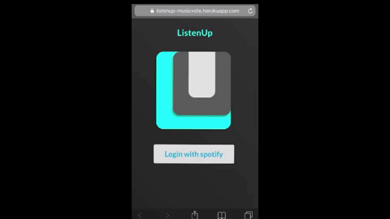
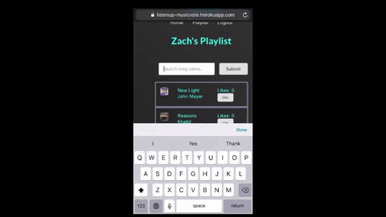

# Listen Up



Listen Up is a mobile optimized web application that allows users to connect playlists created in Spotify in an effort to crowd source those playlist creating responsibilities. Any party host, DJ, road-trip organizer or anyone else with a Spotify account, may connect a Spotify playlist by plugging in their shareable Spotify playlist URL into ListenUp. By giving us that Spotify playlist URL, we instantiate the instantaneous connection between your Spotify playlist and your ListenUp playlist. By creating a ListenUp playlist, you allow participants to:
_ Search for songs via Spotify's search API
_ Add songs to that newly created playlist 
- Vote on songs that are in the playlist
As participants add songs and cast votes on songs, the queue of songs from Listen Up will flow into Spotify and play the songs in the order of votes in descending order.





## Setup

To use this web application, you'll need to take the following steps:

* git clone this repo
* Run the following commands:

* `npm install`
* `npm run start-dev`

## Customize

Now that you've got the code, follow these steps to get acclimated:

* Create a file called `secrets.js` in the project root

  * This file is `.gitignore`'d, and will _only_ be required in your _development_ environment
  * Its purpose is to attach the secret env variables that you'll use while developing
  * However, it's **very** important that you **not** push it to Github! Otherwise, _prying eyes_ will find your secret API keys!
  * It might look like this

  ```
    process.env.SPOTIFY_CLIENT_ID = 'hush hush'
    process.env.SPOTIFY_CLIENT_SECRET = 'pretty secret'
    process.env.SPOTIFY_CALLBACK = '/auth/spotify/callback'
  ```

* To use OAuth with Spotify, complete the step above with a real client ID and client secret obtained from Spotify.
  * You can get them here: https://developer.spotify.com/dashboard/
    * If you already have a Spotify account, log in, select "CREATE A CLIENT ID" and fill out the necessary form.

## Start

`npm run start-dev` will make great things happen!

If you want to run the server and/or webpack separately, you can also `npm run start-server` and `npm run build-client`.

From there, just follow your bliss.
